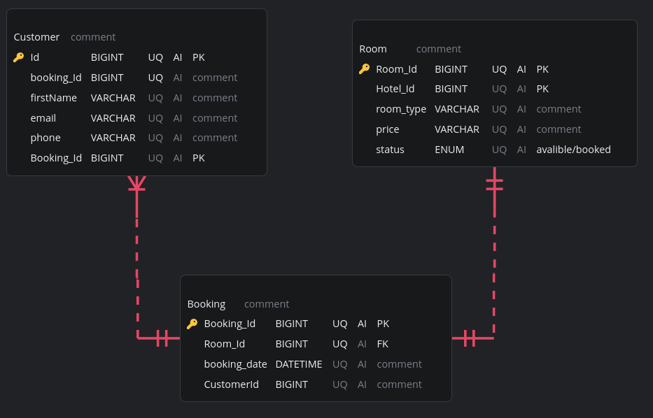

## Core Exercise - Hotel Booking System

#### Epic

”A local hotel wants to keep a record of room bookings. The hotel has a lot of rooms, but **customers** will only be able to choose one room per booking. The person who books the room is not necessarily the person providing contact details.”

#### User Stories
- As a customer, so I can have a place to stay tomorrow night, I want to book a **room** at the **hotel**.
- As the hotel owner, so I can expand my business, I want to add new rooms to the hotel.

Design a simplified booking system for this epic.


### Model
NOTE - The model uses Crow´s Foot Notation for relation cardinalities.



### C#
The C# code below is an autogenerated representation of the model above.
```C#
public class Booking {
  // PK
  public long BookingId { get; set; }
  // FK
  public long RoomId { get; set; }
  public DateTime BookingDate { get; set; }
  public long CustomerId { get; set; }
}

public class Customer {
  // PK
  public long Id { get; set; }
  public long BookingId { get; set; }
  public string FirstName { get; set; }
  public string Email { get; set; }
  public string Phone { get; set; }
  // PK
  public long BookingId { get; set; }
}

public class Room {
  // PK
  public long RoomId { get; set; }
  // PK
  public long HotelId { get; set; }
  public string RoomType { get; set; }
  public string Price { get; set; }
  // avalible/booked
  public string Status { get; set; }
}
``````